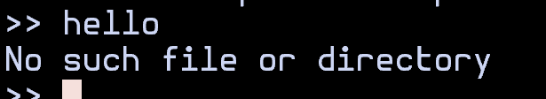
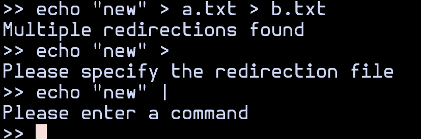

# Bareshell

Bareshell is a minimal command-line interpreter (shell) written in C, designed for simplicity and fundamental functionality. This project serves as an exploration into the core mechanisms of a UNIX-style shell, demonstrating key operating system concepts and system programming techniques. It aims to provide a clear, understandable implementation without the complexity of a full-featured shell.

## Features

Bareshell offers essential command-line functionalities:

*   **Command Execution:** Execute external programs like `ls`, `grep`, or any other executable found in your system's `PATH`.
*   **Argument Handling:** Supports complex command arguments, including those with spaces enclosed in double quotes.
*   **I/O Redirection:** Redirect standard input from a file (`<`) and standard output to a file (`>`).
*   **Piping:** Chain two or more commands together using a pipe (`|`), directing the output of one command as the input to the next.
*   **Background Execution:** Run commands in the background using the `&` operator, allowing the shell to remain interactive for new commands.
*   **Built-in Commands:** Includes fundamental built-in commands such as `cd` (change directory) and `exit` (terminate the shell).

## Building

To build Bareshell, you will need a C compiler (like GCC) and `make`.

1.  **Clone the repository:**
    ```bash
    git clone https://github.com/emgi13/bareshell
    cd bareshell
    ```

2.  **Build the shell:**
    ```bash
    make
    ```
    This command will compile the source code and create an executable named `bareshell` in the root directory.

## Usage

To start the Bareshell, navigate to the project's root directory and run the executable:

```bash
./bareshell
```

You will be greeted by the `bareshell>` prompt, ready to accept your commands.

## Demo Screenshots

Here are some screenshots demonstrating Bareshell in action:

### Basic Command Execution


### I/O Redirection


### Piping


### Background Execution


### Built-in `cd` Command


### REPL Error - Command Not Found



### REPL Error - Syntax Error



## Technical Details

For an in-depth understanding of the Bareshell's architecture, module descriptions, and implementation specifics, please refer to the [technical documentation](technical.md).
