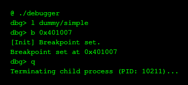
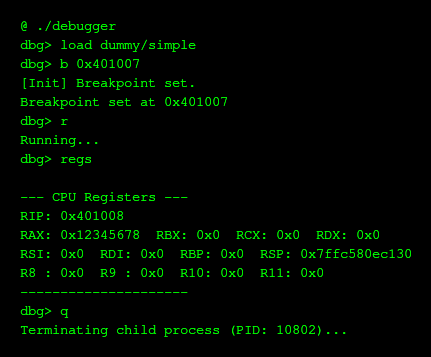
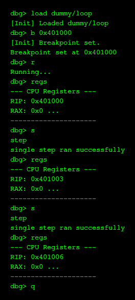
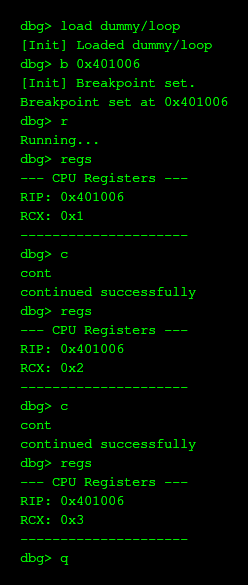

@# Minimal Debugger

Minimal Debugger is a lightweight, CLI-based x86-64 debugger for Linux, written in C++. It demonstrates the fundamental concepts of system programming, process control, and memory manipulation using the `ptrace` system call. This project serves as an educational tool to understand how debuggers like GDB work under the hood.

## Features

Minimal Debugger provides essential debugging capabilities:

*   **Process Loading:** Load and execute ELF binaries.
*   **Breakpoint Management:** Set and clear software breakpoints (`int3`) at specific memory addresses.
*   **Execution Control:**
    *   **Continue:** Resume process execution until the next breakpoint or exit.
    *   **Single Step:** Execute a single instruction, correctly handling breakpoints during the step.
*   **State Inspection:** View current CPU register states (RIP, RAX, etc.).
*   **Process Information:** Check the status and PID of the debugged process.
*   **REPL Interface:** An interactive command-line interface for controlling the debugging session.

## Building

To build the project, you need a C++ compiler (g++) supporting C++17 and `make`.

1.  **Clone the repository:**
```bash
git clone https://github.com/aishik11/minimal_debugger
cd minimal_debugger
```

2.  **Build the debugger:**
```bash
make
```

This will compile the source code and create an executable named `debugger` in the root directory.

## Usage

Start the debugger by running the executable:

```bash
./debugger
```

You will enter the `dbg>` prompt.

### Commands

*   `load <path/to/binary>`: Load a binary program (e.g., `load dummy/loop`).
*   `break <address>` (or `b`): Set a breakpoint at a hex address (e.g., `b 0x401000`).
*   `run` (or `r`): Start the loaded program.
*   `continue` (or `c` or `cont`): Resume execution.
*   `step` (or `s`): Execute one instruction.
*   `regs`: Print current CPU registers.
*   `breakpoints` (or `bp`): List active breakpoints.
*   `status` (or `ps`): Show process status.
*   `quit` (or `q`): Exit the debugger.

### Example Session

```text
dbg> load dummy/loop
[Init] Loaded dummy/loop
dbg> b 0x401006
[Init] Breakpoint set.
Breakpoint set at 0x401006
dbg> run
Running...
dbg> 
--- CPU Registers ---
RIP: 0x401007
RAX: 0x0  RBX: 0x0  RCX: 0x1 ...
---------------------
dbg> continue
[Running] Resuming execution...
continued successfully
```

## Demo Screenshots

Here are some screenshots demonstrating the Minimal Debugger in action:

### Loading and Breakpoints



### Register Inspection



### Single Stepping



### Loop Execution



## Testing

The project includes an automated test suite verifying core functionality against dummy assembly programs.

1.  **Compile tests and run suite:**
```bash
make tests
```

This runs basic input tests, constant checks, and loop logic verification.

2.  **Run specific loop tests:**
```bash
make tests_loop
```

## Technical Details

For an in-depth understanding of the debugger's architecture, class structure, and `ptrace` usage, please refer to the [technical documentation](technical.md).
